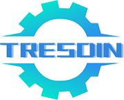

## 推推蛋 ([tuituidan](https://gitee.com/tuituidan))
# 基础框架

- tresdin框架是一套基于Springboot的基础框架
- 提供开发中常用的一些基本功能，集成常用的基础组件，避免重复造轮子

[:octocat: Gitee](https://gitee.com/tuituidan/tresdin)
[⬇ 开始使用](README)
